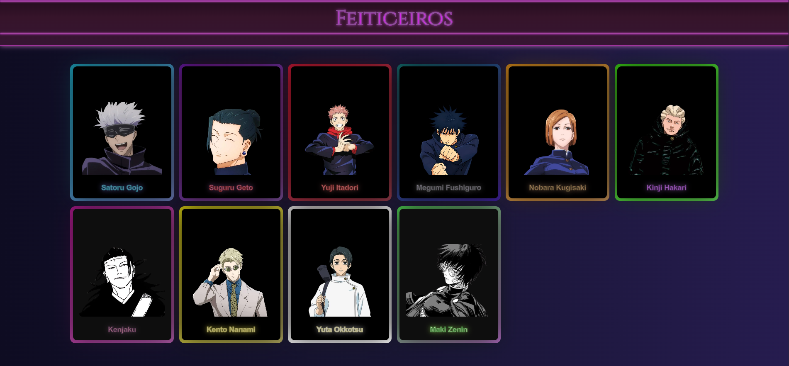
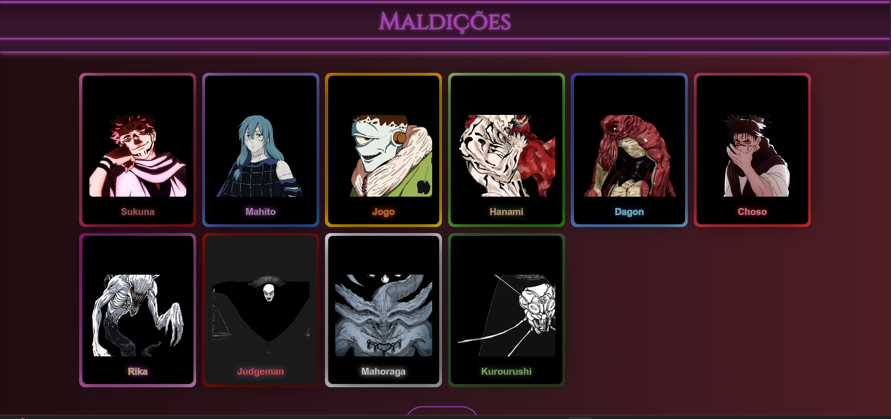

<div align="center">

# ⚡ KaikaDex 呪術廻戦

> *"Em algum lugar do mundo, alguém está amaldiçoando alguém."*


</div>

---

## 📖 Sobre o Projeto

O **KaikaDex** é um projeto de estudo desenvolvido com **HTML, CSS e JavaScript**, inspirado no universo do anime **Jujutsu Kaisen (呪術廻戦)**. A proposta é criar um site enciclopédico — estilo Pokédex — que reúne informações sobre os personagens, feiticeiros e maldições do anime, servindo também como campo de prática para desenvolvimento web e design de interfaces.

---

## ✨ Funcionalidades

- 🏠 **Página Principal** — Apresentação visual temática do universo JJK
- ⚔️ **Página de Feiticeiros** — Informações sobre os principais feiticeiros do anime
- 👹 **Página de Maldições** — Informações sobre as maldições e espíritos amaldiçoados
- 🎨 **Estilização temática** — Design inspirado na identidade visual de Jujutsu Kaisen

---

## 🖼️ Preview do Projeto

<div align="center">





</div>

---

## 📁 Estrutura do Projeto

```
KaikaDex/

  │
  
  ├── 📂 Feiticeiros page/ # Recursos da página de feiticeiros
  
  ├── 📂 Maldições page/ # Recursos da página de maldições
  
  ├── 📂 Imagens/ # Imagens utilizadas no projeto
  
  ├── 📂 script/ # Scripts JavaScript
  
  ├── 📂 CREDITOS/ # Créditos e atribuições

    │
    
    ├── 📄 index_KaikaDex.html # Página principal
    
    ├── 📄 pagina_feiticeiros.html # Página de feiticeiros
    
    ├── 📄 pagina_maldicoes.html # Página de maldições

      │
      
      ├── 🎨 style_KaikaDex.css # Estilo da página principal
      
      ├── 🎨 style_feiticeiros_pagina.css # Estilo da página de feiticeiros
      
      └── 🎨 style_maldicoes_pagina.css # Estilo da página de maldições
```

---

## 🚀 Como Executar

1. **Clone o repositório:**
```bash
git clone https://github.com/angelMind-dev/KaikaDex.git
```

---

## 2. **Acesse a pasta do projeto:**
```bash
cd KaikaDex
```

---

## 3. **Abra o arquivo principal no navegador:**
```bash
# Abra o arquivo index_KaikaDex.html diretamente no navegador
# Ou use a extensão Live Server no VS Code
```

---


## **🛠️ Tecnologias Utilizadas:**
- **HTML5** -	Estrutura das páginas
- **CSS3** -	Estilização e layout temático
- **JavaScript** - Interatividade e dinamismo

---

## **📚 Sobre o Universo JJK:**

Jujutsu Kaisen é um mangá/anime que se passa em um mundo onde energia amaldiçoada (呪力 - Juryoku) flui de emoções negativas humanas, dando origem a maldições (呪霊 - Juurei) — criaturas sobrenaturais perigosas. Para combatê-las, existem os Feiticeiros de Jujutsu (呪術師 - Jutsushi), treinados em escolas secretas.

---

## **🤝 Contribuições**

Contribuições são bem-vindas! Sinta-se à vontade para abrir uma issue ou enviar um pull request.

---

## **👤 Autor**

Angelo de Paula  

**GitHub: [@angelMind-dev](https://github.com/angelMind-dev)**

---

## **⚠️ Aviso**

Este é um projeto de estudo, sem fins lucrativos. Todos os direitos sobre o anime Jujutsu Kaisen pertencem a Gege Akutami e à Shueisha.

---

<div align="center">
  
## 「呪いを呪いで制す」 — "Controlar as maldições com maldições."

⭐ Se curtiu o projeto, deixa uma estrela!

</div>
